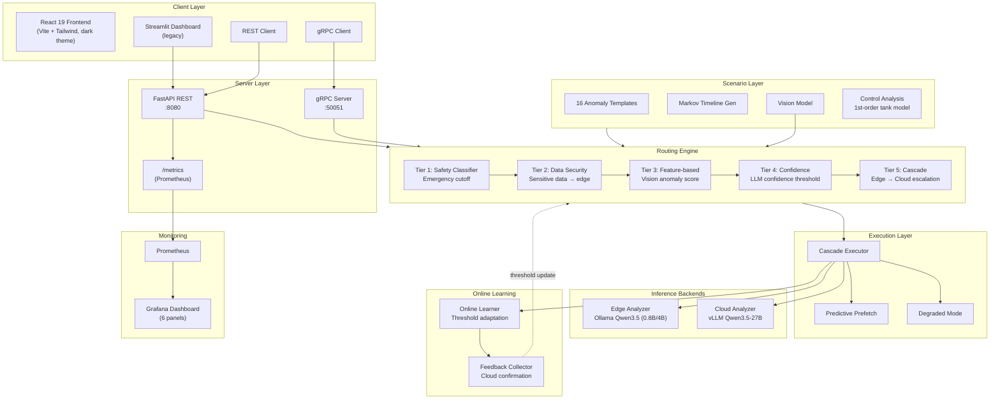
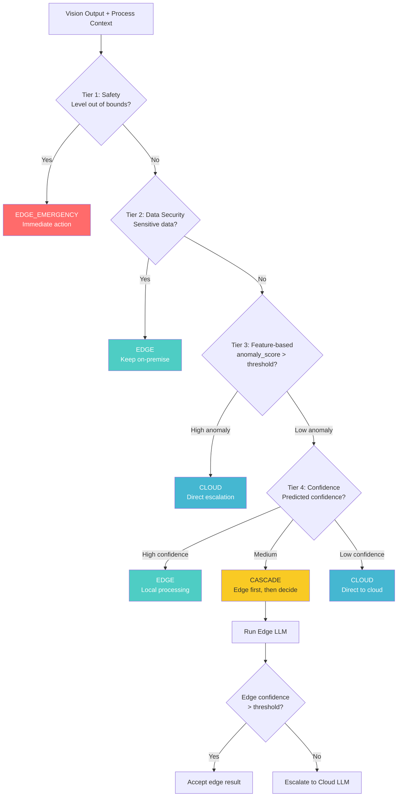
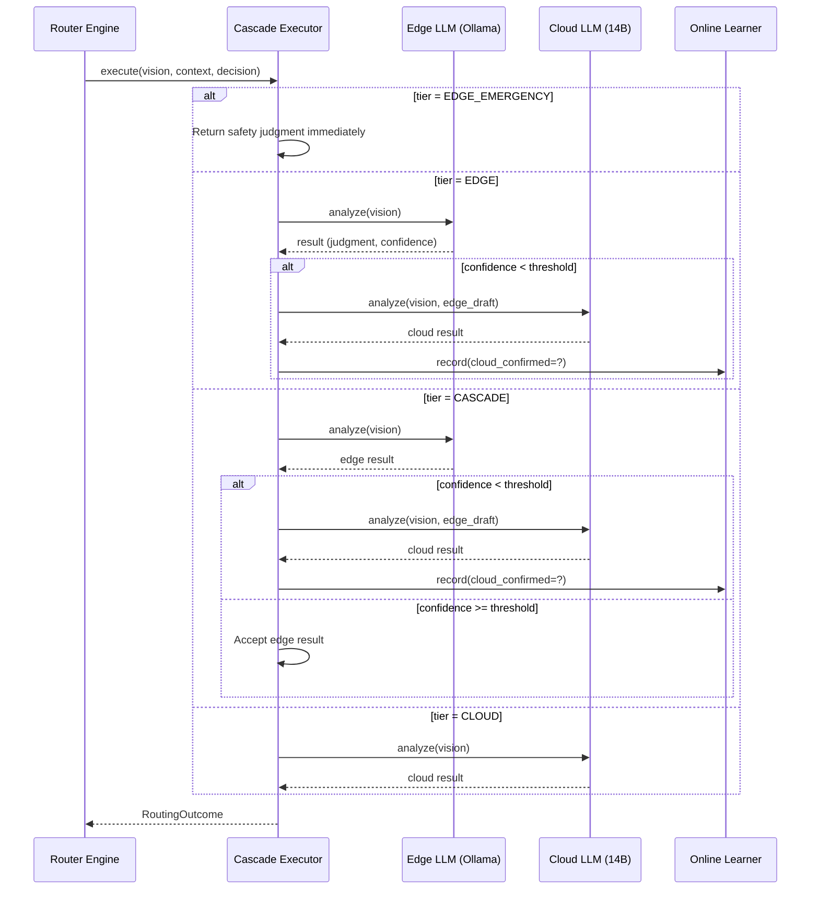

# EdgeRouter Architecture

## System Overview

```mermaid
graph TB
    subgraph Client["Client Layer"]
        Frontend["React 19 Frontend<br/>(Vite + Tailwind, dark theme)"]
        Dashboard["Streamlit Dashboard<br/>(legacy)"]
        GRPC_C["gRPC Client"]
        REST_C["REST Client"]
    end

    subgraph Server["Server Layer"]
        API["FastAPI REST<br/>:8080"]
        GRPC_S["gRPC Server<br/>:50051"]
        Metrics["/metrics<br/>(Prometheus)"]
    end

    subgraph Router["Routing Engine"]
        T1["Tier 1: Safety Classifier<br/>Emergency cutoff"]
        T2["Tier 2: Data Security<br/>Sensitive data → edge"]
        T3["Tier 3: Feature-based<br/>Vision anomaly score"]
        T4["Tier 4: Confidence<br/>LLM confidence threshold"]
        T5["Tier 5: Cascade<br/>Edge → Cloud escalation"]
    end

    subgraph Execution["Execution Layer"]
        Cascade["Cascade Executor"]
        Prefetch["Predictive Prefetch"]
        Degraded["Degraded Mode"]
    end

    subgraph Inference["Inference Backends"]
        Edge["Edge Analyzer<br/>Ollama Qwen3.5 (0.8B/4B)"]
        Cloud["Cloud Analyzer<br/>vLLM Qwen3.5-27B"]
    end

    subgraph Learning["Online Learning"]
        OL["Online Learner<br/>Threshold adaptation"]
        FB["Feedback Collector<br/>Cloud confirmation"]
    end

    subgraph Scenarios["Scenario Layer"]
        ScenarioTemplates["16 Anomaly Templates"]
        Timeline["Markov Timeline Gen"]
        Vision["Vision Model"]
        Control["Control Analysis<br/>1st-order tank model"]
    end

    subgraph Monitoring["Monitoring"]
        Prom["Prometheus"]
        Grafana["Grafana Dashboard<br/>(6 panels)"]
    end

    Dashboard --> API
    GRPC_C --> GRPC_S
    REST_C --> API
    API --> Router
    GRPC_S --> Router

    T1 --> T2 --> T3 --> T4 --> T5

    Router --> Cascade
    Cascade --> Edge
    Cascade --> Cloud
    Cascade --> Prefetch
    Cascade --> Degraded

    Cascade --> OL
    OL --> FB
    FB -.->|threshold update| Router

    Scenarios --> Router
    Vision --> Router

    API --> Metrics
    Metrics --> Prom
    Prom --> Grafana
```

## Routing Decision Flow

```mermaid
flowchart TD
    Input["Vision Output + Process Context"] --> S1

    S1{"Tier 1: Safety<br/>Level out of bounds?"}
    S1 -->|Yes| Emergency["EDGE_EMERGENCY<br/>Immediate action"]
    S1 -->|No| S2

    S2{"Tier 2: Data Security<br/>Sensitive data?"}
    S2 -->|Yes| EdgeSecure["EDGE<br/>Keep on-premise"]
    S2 -->|No| S3

    S3{"Tier 3: Feature-based<br/>anomaly_score > threshold?"}
    S3 -->|High anomaly| CloudDirect["CLOUD<br/>Direct escalation"]
    S3 -->|Low anomaly| S4

    S4{"Tier 4: Confidence<br/>Predicted confidence?"}
    S4 -->|High confidence| EdgeConf["EDGE<br/>Local processing"]
    S4 -->|Medium| CascadeRoute["CASCADE<br/>Edge first, then decide"]
    S4 -->|Low confidence| CloudConf["CLOUD<br/>Direct to cloud"]

    CascadeRoute --> EdgeRun["Run Edge LLM"]
    EdgeRun --> ConfCheck{"Edge confidence<br/>> threshold?"}
    ConfCheck -->|Yes| Accept["Accept edge result"]
    ConfCheck -->|No| Escalate["Escalate to Cloud LLM"]

    style Emergency fill:#ff6b6b,color:#fff
    style EdgeSecure fill:#4ecdc4,color:#fff
    style CloudDirect fill:#45b7d1,color:#fff
    style EdgeConf fill:#4ecdc4,color:#fff
    style CascadeRoute fill:#f9ca24,color:#333
    style CloudConf fill:#45b7d1,color:#fff
```

## Cascade Execution Sequence

```mermaid
sequenceDiagram
    participant R as Router Engine
    participant C as Cascade Executor
    participant E as Edge LLM (Ollama)
    participant CL as Cloud LLM (14B)
    participant L as Online Learner

    R->>C: execute(vision, context, decision)

    alt tier = EDGE_EMERGENCY
        C->>C: Return safety judgment immediately
    else tier = EDGE
        C->>E: analyze(vision)
        E-->>C: result (judgment, confidence)
        alt confidence < threshold
            C->>CL: analyze(vision, edge_draft)
            CL-->>C: cloud result
            C->>L: record(cloud_confirmed=?)
        end
    else tier = CASCADE
        C->>E: analyze(vision)
        E-->>C: edge result
        alt confidence < threshold
            C->>CL: analyze(vision, edge_draft)
            CL-->>C: cloud result
            C->>L: record(cloud_confirmed=?)
        else confidence >= threshold
            C->>C: Accept edge result
        end
    else tier = CLOUD
        C->>CL: analyze(vision)
        CL-->>C: cloud result
    end

    C-->>R: RoutingOutcome
```
